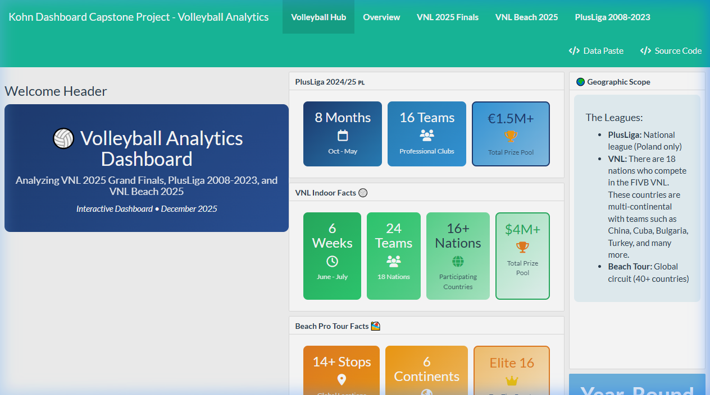
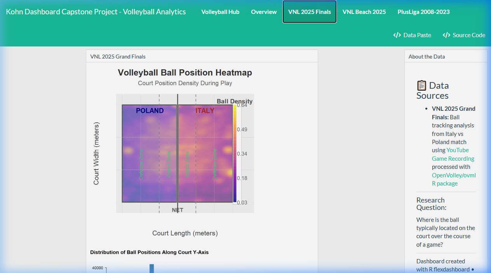
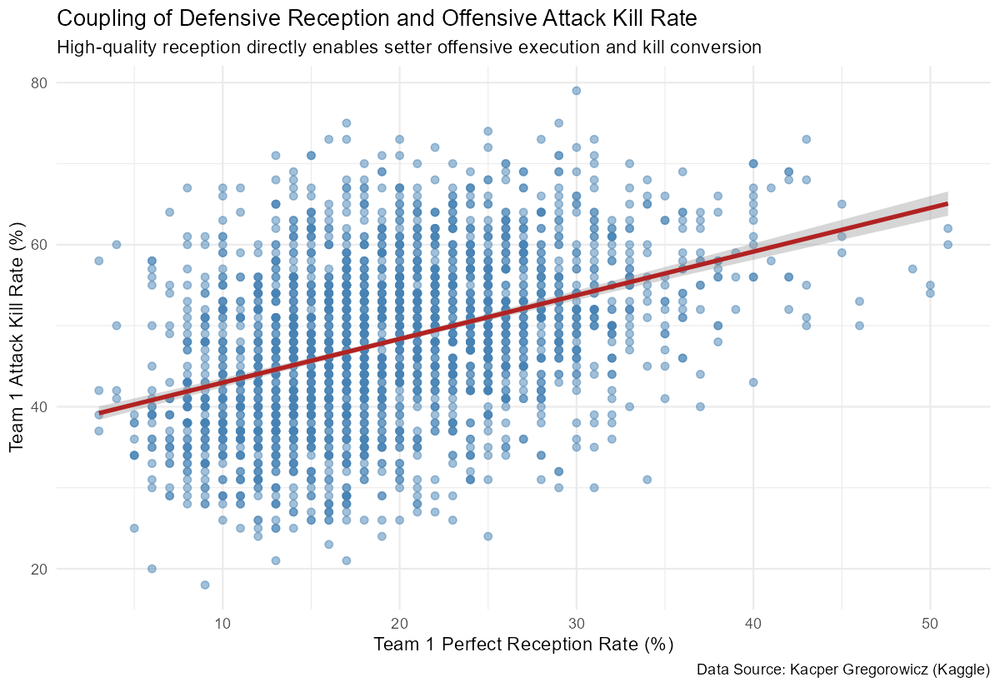
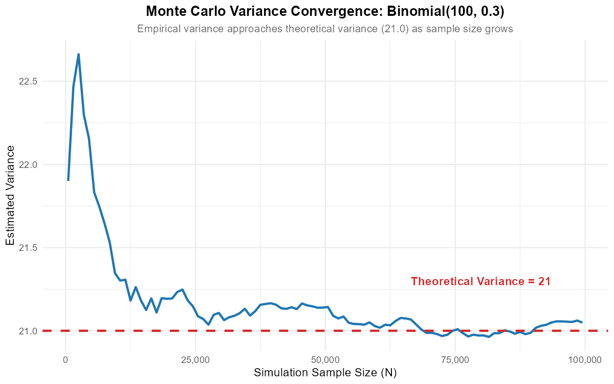
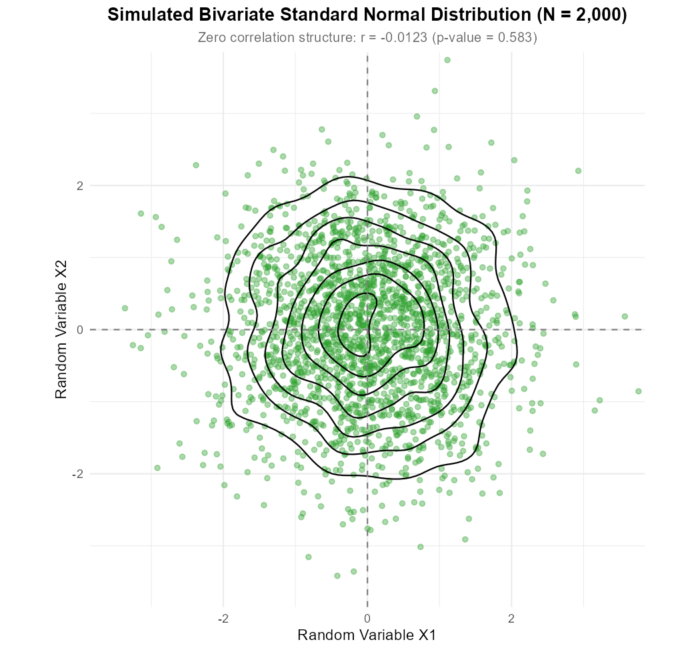
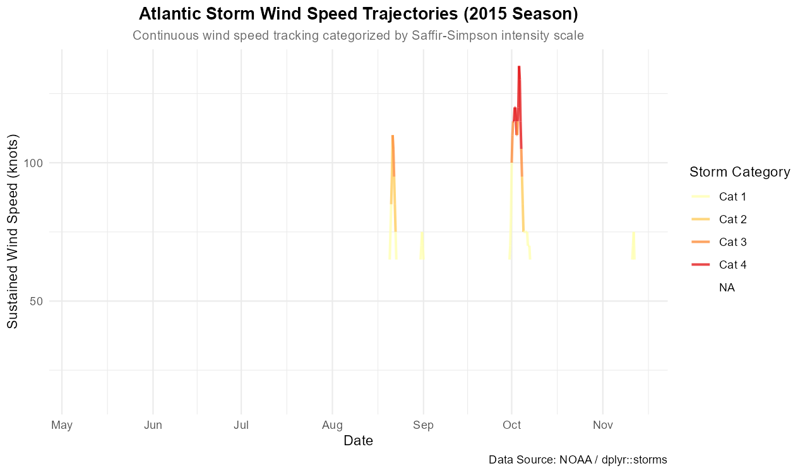
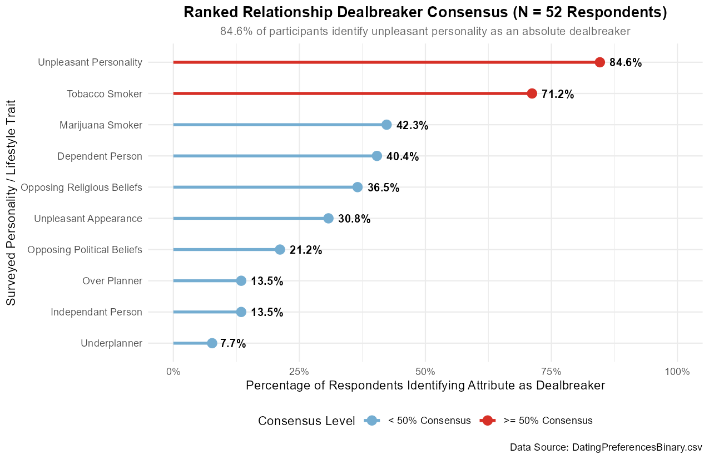

# R / Statistical Computing & Data Visualization Coursework

This repository contains selected statistical computing, data visualization, and applied quantitative analysis coursework completed by Robert Kohn for **STA 229 (Data Visualization) / MTH 229** at Muhlenberg College.

The repository has been curated to showcase original analyses, reproducible R programming, spatial tracking pipelines, stochastic simulations, and statistical modeling while excluding all instructor-provided slides, answer keys, starter worksheets, and raw classroom lecture materials.

---

## Highlights

### 1. Volleyball Analytics & Spatial Court Tracking Dashboard
- **Directory**: [`01-volleyball-analytics-dashboard/`](01-volleyball-analytics-dashboard/)
- **Methods**: Deep learning object detection (YOLOv8 & OpenVolley `ovml`), spatial coordinate projection, bivariate kernel density estimation (`MASS::kde2d`), custom FIVB regulation court rendering, linear regression modeling, and full-scale `flexdashboard` engineering.
- **Key Findings**: Video tracking of the 2025 VNL Grand Finals (Italy vs. Poland) revealed pronounced spatial clustering in the central corridor around the net due to setter distribution and first-tempo quick attacks, with secondary density spikes at the antenna pins (outside/opposite hitters) and 3 meters behind the attack line (back-row attacks).
- **Interactive Dashboard & Spatial Visualizations**:





---

### 2. Professional League Modeling & Reception-Attack Coupling
- **Directory**: [`01-volleyball-analytics-dashboard/`](01-volleyball-analytics-dashboard/)
- **Methods**: Longitudinal match modeling across 15 seasons of Polish Men's PlusLiga (2008–2023) and international beach volleyball circuits.
- **Key Findings**: Linear regression demonstrates a statistically significant positive coupling between perfect reception performance and attack kill conversion rate. Analysis of beach volleyball match durations shows men's matches exhibit wider dispersion and longer endurance tails, while player age densities for winners and losers are closely aligned, demonstrating professional longevity in elite beach volleyball.



---

### 3. Monte Carlo Statistical Simulations & Distribution Modeling
- **Directory**: [`02-monte-carlo-statistical-simulations/`](02-monte-carlo-statistical-simulations/)
- **Methods**: Stochastic Monte Carlo simulation ($N = 100,000$ iterations), running sample variance tracking, continuous density estimation, bivariate normal random vector simulation (`mnormt`), hypothesis testing (`cor.test`), and multi-dimensional adaptive cubature (`cubature::adaptIntegrate`).
- **Key Findings**: Evaluated empirical Law of Large Numbers convergence for $\text{Binomial}(100, 0.30)$, verifying variance convergence to theoretical $\text{Var}(X) = 21.00$ within an absolute error of $0.048$. Bivariate normal simulation confirmed spatial independence ($r = -0.0123$, $p = 0.5827$) and rectangular probability factorization $P([-2, 2]^2) = 0.911070$.





---

### 4. Environmental & Retail Time-Series Dynamics
- **Directory**: [`03-environmental-and-retail-time-series/`](03-environmental-and-retail-time-series/)
- **Methods**: Datetime parsing via `lubridate::make_datetime`, Saffir-Simpson category classification, longitudinal trajectory plotting, and seasonal retail sales decomposition with dual-accent anomaly highlighting.
- **Key Findings**: High-frequency tracking of the 2015 Atlantic hurricane season isolated rapid intensification curves in major Category 3+ cyclones (such as Hurricane Joaquin climbing to Category 4 status in under 48 hours). Longitudinal retail analysis identified recurring January sales spikes across 2000–2011 driven by post-holiday clearances and fiscal year-end reporting.



---

### 5. Applied Visual Refinements & Behavioral Analytics
- **Directory**: [`04-electoral-and-behavioral-visual-analytics/`](04-electoral-and-behavioral-visual-analytics/)
- **Methods**: Intentional plot refinement (aspect ratio optimization, alpha transparency, baseline annotations), 2D density contour modeling (`geom_density_2d_filled`), facial dimorphism perceptual analysis, and survey data reshaping (`tidyr::pivot_longer`, regular expression lookbehinds, `forcats::fct_reorder`).
- **Key Findings**: Democratic vote margin in the 2016 election displayed a strong positive linear correlation with adult bachelor's degree attainment ($BA$). Categorical survey restructuring of 52 participants revealed unpleasant personality as the predominant relationship dealbreaker (84.6% consensus), followed by tobacco usage and incompatible political views.



---

## Skills Demonstrated

### Programming Languages & Environments
- **R (v4.4.2)**: Core computational statistics, graphics pipelines, and script authoring.
- **Python (v3.10+)**: Video frame decoding and deep learning object detection (`opencv-python`, `ultralytics` YOLOv8).
- **RStudio / Posit**: Development environment and dynamic document rendering.

### Data Wrangling & Manipulation
- **Tidyverse Core**: `dplyr` data transformations, `tidyr::pivot_longer` reshaping, and `readr` parsing.
- **Date & Time Operations**: `lubridate::make_datetime`, `make_date`, `quarter`, and `hms` duration conversion.
- **String Normalization**: Regular expression lookbehinds (`str_replace_all`), pattern matching, and cleaning.

### Statistical Modeling & Simulation
- **Probability & Stochastic Simulation**: Monte Carlo sampling ($N = 100,000$), moments estimation, tail probabilities.
- **Parametric Distributions**: Binomial, Poisson, Geometric, Negative Binomial, Uniform, Exponential, Chi-Squared, Beta, and Bivariate Normal.
- **Statistical Inference**: Linear regression (`lm`), Pearson correlation hypothesis testing (`cor.test`), two-way contingency evaluations.
- **Numerical Analysis**: 1D numerical quadrature (`integrate`) and multidimensional adaptive integration (`cubature::adaptIntegrate`).

### Data Visualization & Communication
- **Grammar of Graphics**: `ggplot2` layering, `mosaic` formulas (`gf_*`), hybrid violin-boxplot geometries, and 2D contour density surfaces.
- **Color Aesthetics & Perception**: Color palettes tailored for readability and accessibility (`viridis`, `RColorBrewer`), selective accent colors, and alpha transparency blending.
- **Interactive Dashboards**: `flexdashboard`, `plotly` tooltips, `DT` datatables, and custom CSS layout components.

### Reproducibility & Workflow
- **R Markdown (`.Rmd`)**: Literate programming documents combining mathematical formulations, R code chunks, and visual outputs.
- **Modular Scripts**: Standalone, portable `.R` scripts utilizing relative paths for reproduction.

---

## Repository Structure

```
MTH229/
├── .gitignore
├── README.md
├── setup.R
│
├── 01-volleyball-analytics-dashboard/
│   ├── README.md
│   ├── dashboard.Rmd
│   ├── dashboard.html
│   ├── analysis.R
│   ├── tracking_pipeline/
│   │   ├── README.md
│   │   ├── vb_tracking.py
│   │   └── frame_convert.R
│   ├── data/
│   │   ├── README.md
│   │   ├── Mens-Volleyball-PlusLiga-2008-2023.csv
│   │   ├── ball_positions_sample.csv
│   │   └── vb_matches_sample.csv
│   └── figures/
│
├── 02-monte-carlo-statistical-simulations/
│   ├── README.md
│   ├── analysis.R
│   ├── report.Rmd
│   ├── report.html
│   └── figures/
│
├── 03-environmental-and-retail-time-series/
│   ├── README.md
│   ├── analysis.R
│   ├── report.Rmd
│   ├── report.html
│   └── figures/
│
├── 04-electoral-and-behavioral-visual-analytics/
│   ├── README.md
│   ├── analysis.R
│   ├── report.Rmd
│   ├── report.html
│   ├── data/
│   │   ├── README.md
│   │   └── DatingPreferencesBinary.csv
│   └── figures/
│
└── assets/
    └── screenshots/
```

---

## Running the Work

### 1. Clone the Repository
```bash
git clone https://github.com/rkohnmn/MTH229.git
cd MTH229
```

### 2. Install Required R Packages
Open R or RStudio in the repository directory and run:
```R
source("setup.R")
```

### 3. Run Standalone Analyses
Each project contains a self-contained `analysis.R` script that executes the data pipelines and generates all figures:
```R
# Project 1: Volleyball Analytics
source("01-volleyball-analytics-dashboard/analysis.R")

# Project 2: Monte Carlo Simulations
source("02-monte-carlo-statistical-simulations/analysis.R")

# Project 3: Time Series Dynamics
source("03-environmental-and-retail-time-series/analysis.R")

# Project 4: Applied Visual Refinements
source("04-electoral-and-behavioral-visual-analytics/analysis.R")
```

### 4. View or Re-knit Reports and Dashboard
Pre-compiled standalone HTML reports are provided in each directory. To re-render any document:
```R
# Render the interactive dashboard
rmarkdown::render("01-volleyball-analytics-dashboard/dashboard.Rmd")

# Render any of the analytical reports
rmarkdown::render("02-monte-carlo-statistical-simulations/report.Rmd")
```

---

## About Me

**Robert Kohn**  
Muhlenberg College — Class of 2026  
Triple Major: **Mathematics · Statistics · Physics**  
GitHub: [https://github.com/rkohnmn](https://github.com/rkohnmn)  

Aimed at software engineering, data science, quantitative research, and technical analytical roles.
